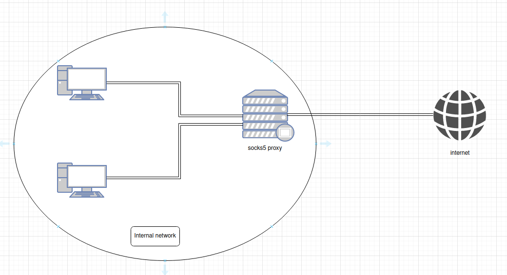
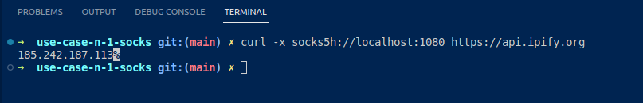

# Use case n°1 - Socks


## What is SOCKS

SOCKS, Socket Secure, is an Internet protocol that allows you to hide your IP address by sending your traffic through a remote server. A SOCKS proxy acts as a bridge between your device and the Internet. When you connect to the Internet through a SOCKS proxy, your traffic is routed through the proxy server, which then makes the connection to the destination website or server on your behalf.
Using a  SOCKS proxy has several advantages, such as the fact that the  SOCKS protocol supports almost every protocol, including HTTP, HTTPS, and FTP. SOCKS version 5 also uses both TCP and UDP, which allows for faster connection.

## Use case 

There are several use cases for a SOCKS proxy. In Cybersecurity, it is often used as a penetration testing tool, either alone or in combination with other tools. For example, it happens that pentesters hired by a company to test its internal network are not given unrestricted access to the corporate network; the only access to a server or network they have is remote access, called a jump box, to a secured machine via RDP. And usually the company does not allow the installation of (non-administrative) tools such as nmap, etc. on the machine(forcing pentesters to go through a long procedure to get the tools they need). In such cases, tools like "SOCKS Over RDP" from [NCCGroup](https://github.com/nccgroup/SocksOverRDP) can be useful, facilitating the installation of security testing tools by enabling a SOCKS proxy on the machine and sending the requests through the proxy.

In this example, we will consider the following architecture/topology/scenario:

A network administrator has configured a SOCKS 5 proxy on the local network so that user traffic passes through the proxy before reaching the Internet. In this case, the proxy is used like a network firewall, allowing the administrator to filter outgoing and incoming HTTP and HTTPS traffic and better control what users can and cannot access on the Internet.



Although there are many advantages to using a SOCKS5 protocol, as mentioned earlier, it also has some disadvantages. For example, while the version 5 of the protocol provides authentication and supports SSH, it does not provide encryption. Thus, an SSH tunnel can be established between the server and the client, but the traffic leaving the server is completely unprotected. If the visited website is an HTTP website for example, all data is likely to be seen by an attacker.
To fix this problem, we connect to the Snowpack Network Overlay(SNO), as shown in the figure below, and route all traffic from the proxy server directly to a Snowgate before it reaches the Internet.


## SOCKS5 over SNO


When traffic is sent through the snowpack network, metadata such as IP addresses are completely removed from the packets before being routed on the Internet, making the users completely anonymous, even to the snowpack network; data is encrypted, split (into what we call snowflakes) and sent over the Internet through different routes, making it next to impossible to track. Moreover, it doesn’t change anything for the administrator as he is still able to control and filter the HTTP/HTTPS network’s traffic as he would without the snowpack network.

## Deploy

### Requirements 

- For the purpose of this demonstration, we will be using Docker. Check out the [docker documentation](https://docs.docker.com/engine/install/) to install Docker and docker compose on your host if not already installed. 
- For the SOCKS5 proxy, we will be using [Sergey Bogayrets's](https://github.com/serjs/socks5-server) SOCKS5 proxy image found [here](https://hub.docker.com/r/serjs/go-socks5-proxy/).
- For the SNO, the Dockerfile and docker-compose.yml files will be provided. **Running the snowpackuser service will however require the login credentials (username and password) of a user who has at least subscribed to the RedSnow package.** Visit [the snowpack webpage](  to learn more about the different packages available and how to subscribe to a plan that meets your needs.

### Configuration

#### Step 1 : Build the snowpack image 

***This step is optional because the docker-compose.yml file has a build section for the snowpack image. So if no image is built prior to launching the services with docker compose, the image will be built.***

To build the image, use the following command:
```
docker compose build
```

If you had previously built the image, and wanted to rebuild it after a modification for example, use the ***--no-cache*** flag like so:
```
docker compose build --no-cache
```

#### Step 2 : Choosing your routes 

To choose your exit nodes, or your routes, edit the config_user_routes.json file in the snowpack/ folder. You can either change the country or directly use the nodes IP addresses if you have access to them.
```
{
  "ROUTE1": {
    "Id": 1,
    "Route": {
      "Country": "Germany"
      
      
    },
    "Protocols":
    [
      {
        "name": "any",
        "not daddr": ["35.180.139.74", "1.1.1.1"],
        "not dport": ["8081", "2000-2050", "3000-4000"]
      }


    ]
  },
  "ROUTE2": {
    "Id": 2,
    "Route": {
      "Pu2": "Pu2_IP_address",
      "Pu1": "Pu1_IP_address",
      "Ps2": "Ps2_IP_address",
      "Ps1": "Ps1_IP_address",
      "PR": "PR_IP_address"
     
    },
    "Protocols":
    [
      {
        "name": "icmp"
      },
      {
        "name": "tcp",
        "daddr": ["8.8.8.8"],
        "dport": ["8081", "2000-2050", "3000-4000"]
      }
    ]
  }
}
  ```
  You may change the Country name to France, Poland or another country, as long as it's a country in which Snowpack nodes are deployed.
  Replace the "Pu2_IP_address" by ***actual***  IP addresses.
  ***Note that you can choose to use the Country name for both your routes, or only IP addresses. Both ways work well.***
  ***Be mindful of characters when editing the documents. Unexpected charcaters such as unwanted spaces will result in the service not running.*** 


#### Step 3 : Launch and stop the services 

Before launching the services, change the environment variables values to your username and your password in the docker-compose.yml file like so: 
```
environment:
      #Replace your login credentials here! YOU NEED TO HAVE AT LEAST SUBSCRIBED TO A REDSNOW PLAN!
        USER: 'myusername' 
        PASSWORD: 'Password1234'
```
***myusername*** and ***Password1234*** being your login credentials for your Snowpack account.

***Note that if you are not at least subscribed to the RedSnow plan as mentionned in the Requirements section, the authentication will fail, and the snowpack service will NOT launch.***

Next, launch the services with the following command:
```
docker compose up
```

To stop the services and remove the containers, use the following command:
```
docker compose down
```
***You can also use Ctrl+C to stop the services. However, the containers will not be removed, and any changes you make will not be taken into account. If you relaunch the services, the previous containers will simply be turned up.***

#### Step 4 : Test

You can test tat your configuration is working either directly on the command line or with a browser such as firefox.

##### CLI

Use the following curl command to check your IP address on the Internet :

**Without SOCKS5 over snowpack:**
```
curl -k -v http://icanhazip.com
```


**With SOCKS5 over snowpack:**

- Use the following command to find out your IP address on the Internet

```
curl -x socks5h://localhost:1080 https://api.ipify.org
```




***If configured properly, the first curl command should give your ISP's IP address, and the second one should give your Snowpack exit node.***


#### Test with a browser

Open the Firefox browser. Access the Settings by clicking on the burger Menu on the top right corner.


Once on the Settings page, scroll all the way down to the Network Settings. Then click on Settings.
Next, select the Manual proxy configuration, click on SOCKS v5, then type the IP address of your docker0 interface and click ok.


After completing the proxy configuration, open another window, and go to [https://www.whatsmyip.org/](https://www.whatsmyip.org/) to know your IP address on the Internet. Follow the link with and without the proxy configuration to observe the IP address difference.


# Contact Us

If you have any questions, suggestions, feel free to [contact us](mailto:support@snowpack.eu).
Check out our [website](https://www.snowpack.eu) for more information about our technology and our services.