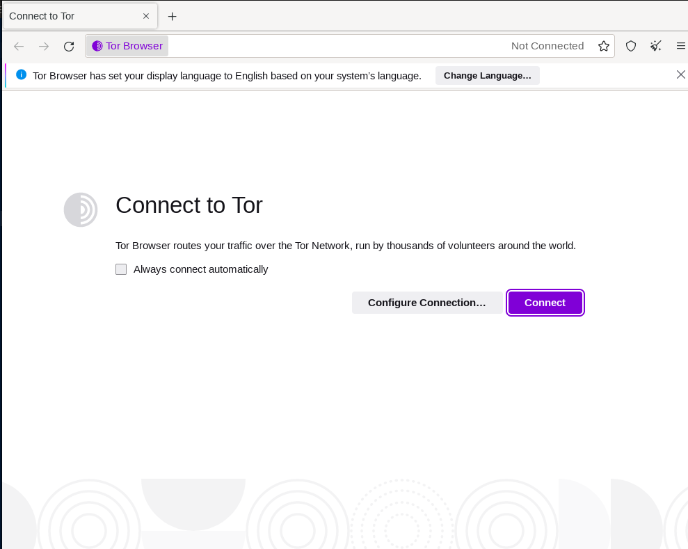

# Use case n°2 - Tor-browser


## What is Tor?

Tor, The Onion Network, is a network of voluntarily operated servers around the world that allows users to remain anonymous on the regular Internet and surf the Dark Web.
When a user sends a request through Tor to access a website, the request is sent through three randomly selected servers, called Tor relays, before reaching the final destination. Each relay adds an encryption layer and changes the sender's IP address with its own, making the original sender's IP address invisible to the next relay node. Each relay node is therefore unable to trace the entire path of the request from the original source to the final destination.

The Tor network is accessible in 2 modes: *server* and *client*. Anyone with the necessary resources and knowledge, can easily run a Tor relay and contribute to the growth of the Tor network (learn more about running a Tor relay [here](https://blog.torproject.org/new-guide-running-tor-relay/)).
The second option, which is also the most common, is client mode. This mode is mainly used for the following reasons:
- Privacy on the Internet: typically in countries/regions where the Internet traffic is thoroughly investigated and/or tracked by either the government for influence purposes, access control on certain websites,(etc. or ISPs for commercial purposes for example), and any third party trackers used for advertisement
- Hidden services: accessing websites that are not accessible on the regular Internet: the Dark web

Several means to use the Tor network as a client are available today: whether you want to use the Tor network solely for your web browsing traffic or your entire system.
In this article, we will be using Tor Browser, a preconfigured, modified version of Firefox. This browser uses the Tor network and  forces all the browser traffic to be routed through tor relay nodes.


### Use case 

In certain parts of the world where surveillance, censorship, and manipulation are so present that rights such as freedom of expression and the right to justice are nearly non-existent, activists, whistleblowers, etc., seek to fight back and protect the right of the people to know by anonymously reporting facts, potential threats, or events that are not known to the public, whether social or political. For privacy and security reasons, they often use tools such as SecureDrop, a tool that allows to accept anonymous files, or OnionShare, which allows hosting Onion websites, creating private chats, or sending and receiving files through the tor- browser.

As mentioned before, when using Tor to access a service on the Internet, the client’s IP address is hidden to the final server. However, a client that uses Tor is not completely anonymous because the entry/Guard node knows his IP address, he’s therefore still likely to be tracked on the Internet, and even be hacked.

**How to hide your IP address before accessing Tor?**

For additional protection we will use the Snowpack Network Overlay (SNO). SNO is a network that provides invisibility (anonymity) on the Internet without any third party. When traffic is sent through the SNO, metadata is removed, making the identity of the sender unkwown, even to Snowpack; then it is broken into fragments. Those fragments are then sent over different routes on the Internet, providing security and privacy. By sending our traffic through SNO before accessing the Tor network, we can protect the identity of our users on the Tor network. Also, we know that a Tor relay node can be operated by anyone, even an attacker could operate one. And in our case, where sensitive information is exchanged, it is critical that our user's identity remains anonymous to prevent our investigation from being tampered with or, worse, their security from being compromised. Therefore, even if an attacker were to put back together all the complementary fragments sent through SNO and reconstruct the traffic flow, he would not be able to figure out the identity of our user. As a result, by sending the user's traffic through SNO, our user is able to safely access the hidden services on the Tor network while staying anonymous.


Our scenario then looks like this : 
- Our user connects to Snowpack using their DarkSnow credentials
- Our user opens Tor Browser and connects to the Tor network
- Traffic from the Tor Browser is sent through SNO, which on a network level means that our user is directly connected to Snowpack, and the tor entry node sees Snowpack
- Our user accessing the onion website to communicate with a journalist


## Deploy

In this part, we will show step by step how to send our user's traffic through the SNO before accessing the Tor network.

#### Requirements 

- We will use Docker for our set up to properly isolate Torbrowser usage from our computer standard communication.
- If you do not have Docker and docker compose installed, click [here](https://docs.docker.com/engine/install/) to install.


#### Step 1 : Building images 

Use the following command to build the torbrowser and snowpack user images:

```
docker compose build --no-cache
```
This command will build both images using the build section on each service on the docker-compose.yml file.
***If you prefer building the images one by one to reuse them separately for example, use the following command :***
```
docker build -t torbrowser .
```
This command will use the Dockerfile to build an image, will name it torbrowser and tag it "latest".

#### Step 2 : Launching the services 


##### Torbrowser alone 


1. Before launching the torbrowser service alone, replace "username" with your host's username in the docker-compose_torbrowseronly.yml file.
To get your username, type the following command in Linux:
```
whoami
```


2. Then, launch torbrowser with the following command:
```
docker compose -f docker-compose_torbrowseronly.yml up
```
If everything works well; you should be prompted with the Tor Browser.



3. To stop and remove the container, use the following command :
```
docker compose -f docker-compose_torbrowseronly.yml down
```


##### Torbrowser over SNO


##### Requirements

In this example, we will be launching the snowpackuser service with multiroutes configuration. To follow along, and be able to use the Tor Browser over SNO, you need to have subscribed to at least the Snowpack DarkSnow plan. **If you are subscribed to a FreeSnow, OneSnow plan,  or if you do not have a Snowpack account, you will not be able to run the snowpackuser service**. Learn more about about the different packages available and how to subscribe to a plan that meets your needs at [snowpack.eu](https://snowpack.eu/).


1. Before launching the services, repeat the Step 2.1 of the previous part. In the docker-compose.yml file, change the keyworkd "username" in the volumes section of the tor_over_snowpack service to your host username.

2. In the same file (docker-compose.yml) change the environment variables values to your Snowpack account login credentials. ***Remember, you need to be subscribed to at least DarkSnow!***


***Replace "myusername" and "Password1234" with your credentials.***

3. As mentioned before, we will be launching SNO with multiroutes. This option lets you choose 2 different routes for your traffic. To do so, edit the config_user_routes.json file in the snowpack/bin folder. You may do so by using a country name or IP adresses.
```
{
  "ROUTE1": {
    "Id": 1,
    "Route": {
      "Country": "Germany"
      
      
    },
    "Protocols":
    [
      {
        "name": "any",
        "not daddr": ["35.180.139.74", "1.1.1.1"],
        "not dport": ["8081", "2000-2050", "3000-4000"]
      }


    ]
  },
  "ROUTE2": {
    "Id": 2,
    "Route": {
      "Pu2": "Pu2_IP_address",
      "Pu1": "Pu1_IP_address",
      "Ps2": "Ps2_IP_address",
      "Ps1": "Ps1_IP_address",
      "PR": "PR_IP_address"
     
    },
    "Protocols":
    [
      {
        "name": "icmp"
      },
      {
        "name": "tcp",
        "daddr": ["8.8.8.8"],
        "dport": ["8081", "2000-2050", "3000-4000"]
      }
    ]
  }
}
```

4. Launch the services with the following command:
```
docker compose up
```

5. If you have made changes to the any of the dockerfiles  you can rebuild the images with the following command:
```
docker compose build --no-cache
```

6. To stop the services and remove the conatiners, use the following command:
```
docker compose down
```

# Contact Us

If you have any questions, suggestions, feel free to [contact us](mailto:support@snowpack.eu).
Check out our [website](https://www.snowpack.eu) for more information about our technology and our services.
