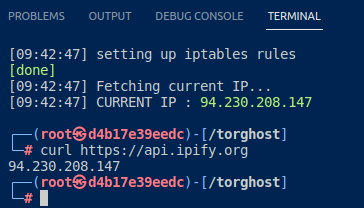

# Use case n°3 - Torghost


## What is Torghost?

**Torghost** is another method that allows a user to use the Tor network as a *client*.

***What is Tor?***

Tor, The Onion Router, is a network of voluntarily operated servers around the world that allows users to remain anonymous on the regular Internet and surf the Dark Web.
When a user sends a request through Tor to access a website, the request is sent through three randomly selected servers, called Tor relays, before reaching the final destination. Each relay adds an encryption layer and changes the sender's IP address with its own, making the original sender's IP address invisible to the next relay node. Each relay node is therefore unable to trace the entire path of the request from the original source to the final destination.

 As mentioned in our previous case, there are several ways to use Tor relay nodes to route your traffic.In this article, we will use Torghost.Torghost is a Python script designed for a more holistic use of the Tor network: it routes all of the device's network traffic over the Tor network, providing anonymity not only for browser traffic, but for all traffic from the computer.

## Use case 

Let's consider the following use case: A pentester wants to investigate the behaviour of a malware spread by an attacker on a company's network. For this purpose, he decides to follow the steps that a normal user would follow if he had been targeted/ affected. However, since this malware is likely to have beaconing signals exchanged between the affected device and the attacker’s command-and-control(C2) server, some level of protection on the pentester's side is required to avoid being fully compromised. The pentester then decides to install Torghost on his kali Linux.


#### Why use Snowpack Network Overlay (SNO)? 

By using the Tor network to route the Kali Linux’s traffic, the IP address of the host remains hidden. However, the Tor network’s Guard Relay being ***directly connected to the host and therefore knows of our identity.*** Thus, if this node were to be compromised, our identity could be known. Similarly, since Tor relays can be run by anyone with the necessary resources, it’s not excluded that one of our nodes be operated by an attacker.

To overcome this problem, ***we use the Snowpack Network Overlay (SNO)*** to enter Tor. Sending our network traffic through SNO before it is routed over the Tor network adds a layer of privacy to the host: our host’s IP address is stripped from the packets, making it completely anonymous, even to Snowpack. The attacker’s C2 and anyone sniffing the traffic on that end of the communication will still see the Exit Relay’s IP address, and the Guard Relay will see Snowpack's public address.


# Deploy

### How to use Torghost with SNO?

#### Requirements

- For the purpose of this demonstration, we will need to have Docker and docker-compose installed and up to date. Check out the [docker documentation](https://docs.docker.com/engine/install/) to install if they are not already installed on your host.
- For our Kali linux, we will use the [kalilinux/kali-rolling:latest](https://hub.docker.com/r/kalilinux/kali-rolling) image by Kali.
- Finally, we will use [Susmith Krishnan's](https://github.com/SusmithKrishnan/Torghost) work on Torghost.


### Torghost on Kali Linux   


On the first part of our demonstration, we will launch Torghost on a Kali linux.

##### Step 1: Build the image 

First, build the image to launch Torghost only on the Kali Linux with the following command:

```
docker compose -f docker-compose-Torghost.yml build
```
Because the docker-compose-Torghost.yml file has a build section, you can also use the following command:
```
docker compose -f docker-compose-Torghost.yml up
```
If any changes have been made to the Dockerfile, and you wanted to rebuild the image, use the --no-cache flag like so:
```
docker compose -f docker-compose-Torghost.yml build --no-cache
```

##### Step 2: Launching Torghost

Once the container is created and the service is running, open another terminal.
1. Type the following command to get the running container's ID:
```
docker container ps 
```
2. The next step is to access the container to launch the Torghost script. 
```
docker exec -it d4b17e39eedc /bin/bash
```
You are then prompted with a bash terminal inside the container.


3. Modify the Torghost.py script to add the docker network IP address to the exception.

Open the Torghost.py script with nano ediTor:
```
nano Torghost.py
```
Scroll to the iptables rules and in the NON_Tor, add the docker network address and the use-case-n-3-Torghost network's IP address created in the docker-compose-Torghost-over-snowpack.yml file as shown in the picture below.


Then save and exit by typing Ctrl+S then Ctrl+X

4. Launch the Torghost script
```
python3 Torghost.py -s
```
If well configured, you should get an exit node IP address from the Tor network as shown in the picture below.


5. Testing the script
```
curl https://api.ipify.org
```



6. Switch circuit and request new Tor exit node
```
python3 Torghost --switch
```

7. Commit the changes made to the container into a new image

Exit the container with the "exit" command and save the changes made to the container in a new image called Torghostkali:1.0
```
docker commit d4b17e39eedc Torghostkali:1.0
```

8. Stop and remove containers
```
docker compose -f docker-compose-Torghost.yml down
```


### Torghost over SNO

On this second part, we send the kali's traffic through SNO.


##### Requirements

- In order to do this part, you need to have followed the first part and to have created the Torghostkali:1.0 image.
- ***To be able to run the snowpack user service with Torghost, you need to be subscribed to the DarkSnow plan of Snowpack. Use your Snowpack account login credentials in the docker-compose-Torghost-over-snowpack.yml file to have the service run***. Learn more about about the different packages available and how to subscribe to a plan that meets your needs at [snowpack.eu](https://snowpack.eu/).


##### Step 1: Choosing your routes 

Before launching the services, you can choose your routes by modifying the config_user_routes.json file in the snowpack/ folder. You can either choose the country or directly add the IP addresses of your nodes.
```
{
  "ROUTE1": {
    "Id": 1,
    "Route": {
      "Country": "Germany"
      
      
    },
    "Protocols":
    [
      {
        "name": "any",
        "not daddr": ["35.180.139.74", "1.1.1.1"],
        "not dport": ["8081", "2000-2050", "3000-4000"]
      }


    ]
  },
  "ROUTE2": {
    "Id": 2,
    "Route": {
      "Pu2": "Pu2_IP_address",
      "Pu1": "Pu1_IP_address",
      "Ps2": "Ps2_IP_address",
      "Ps1": "Ps1_IP_address",
      "PR": "PR_IP_address"
     
    },
    "Protocols":
    [
      {
        "name": "icmp"
      },
      {
        "name": "tcp",
        "daddr": ["8.8.8.8"],
        "dport": ["8081", "2000-2050", "3000-4000"]
      }
    ]
  }
}
```
You may change the Country name to France, Poland or another country, as long as it's a country in which SNO nodes run.
Replace the "Pu2_IP_address" by ***actual***  IP addresses.
***Note that you can choose to use the Country name for both your routes, or only IP addresses. 

#### Step 2 : Inserting Login Credentials in docker-compose

As mentionned before, running Tor with SNO requires to have subscribed at least to the DarkSnow plan. In the docker-compose-Torghost-over-snowpack.yml file, change the USER and PASSWORD values to your Snowpack account credentials.
```
environment:
#Replace your login credentials here! YOU NEED TO HAVE AT LEAST SUBSCRIBED TO A DARKSNOW PLAN!
  USER: 'snowpack' 
  PASSWORD: 'Snowpack1234'
```
Replace **snowpack** and **Snowpack1234** with your username and password.

#### Step 3 : Launching the services 

1. Use the following command to launch both services :
```
docker compose -f docker-compose-Torghost-over-snowpack.yml up 
```

2. Access the Torghostkali container to start the Torghost script

- First get the container's ID by typing the following command :
```
docker container ps
```
- Then execute the container in /bin/bash to run the Torghost script 
```
docker exec -it 9e77fb958339 /bin/bash
```
- Once in the container, launch the Torghost script with the command:
```
python3 Torghost -s
```

3. To test, use the following:
```
curl https://api.ipify.org
```

4. To switch circuit
```
python3 Torghost --switch
```


# Contact Us

If you have any questions, suggestions, feel free to [contact us](mailto:support@snowpack.eu).
Check out our [website](https://www.snowpack.eu) for more information about our technology and our services.
